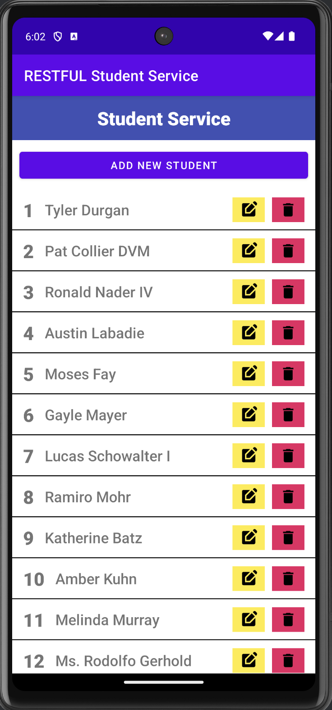
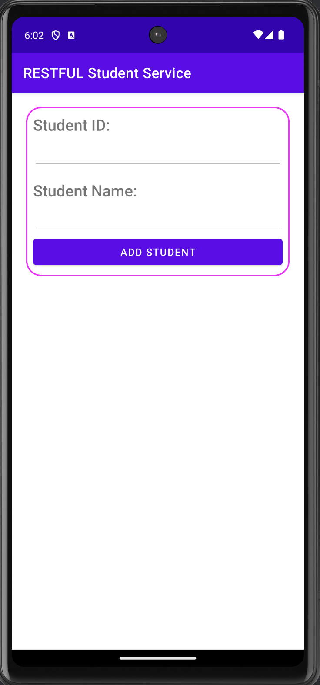
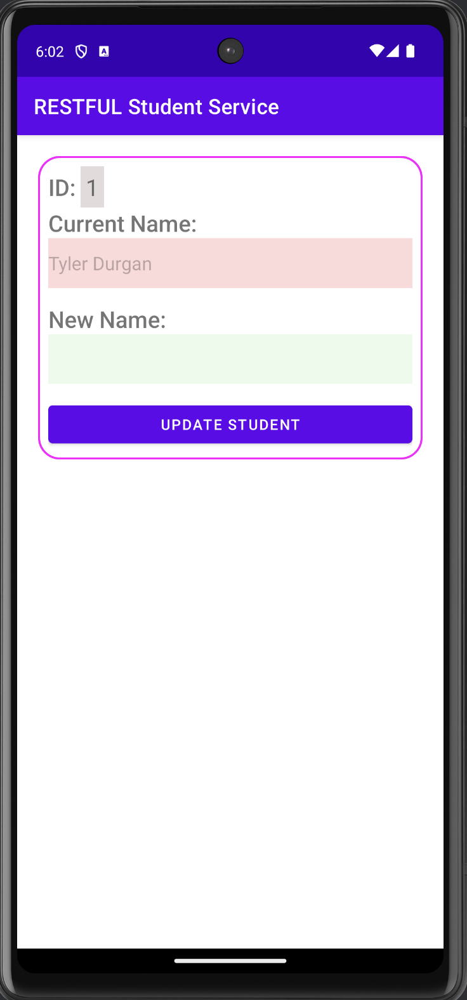

# RESTful Student Service

An **Android application** designed to demonstrate a simple **Student Service**. This app allows users to interact with student data through a clean and user-friendly interface. It communicates with a **RESTful API** to perform CRUD operations such as **Create**, **Read**, **Update**, and **Delete** on student records.

## Features

- **View Students**: Displays a list of students with their IDs and names fetched from the API.
- **Add New Student**: Allows users to create a new student record using a dedicated page.
- **Update Student**: Provides functionality to update an existing student’s name.
- **Delete Student**: Enables users to delete a student record directly from the list.
- **Custom ListView**: Implements a custom layout using an adapter to display the student list.
- **Progress Bar**: Shows a progress bar during data fetch operations for a smooth user experience.

## API Details

This application integrates with a mock RESTful API provided by [mockAPI](https://mockapi.io). The endpoint used is:

> **Base URL**: [https://67405dc2d0b59228b7efc3c0.mockapi.io/api/v1/students](https://67405dc2d0b59228b7efc3c0.mockapi.io/api/v1/students)

### API Endpoints
- **GET** `/students`: Fetch all student records.
- **POST** `/students`: Add a new student record.
- **PUT** `/students/{id}`: Update an existing student record.
- **DELETE** `/students/{id}`: Delete a student record.

## Screenshots

<p align="center">
  
  
  
</p>

## How It Works

1. **Fetch Student Data**:
   - The app uses a `GET` request to retrieve a list of students from the API.
   - Displays the data in a `ListView` using a custom layout.

2. **Add New Student**:
   - Users can navigate to the "Add New Student" page and input the student ID and name.
   - A `POST` request is sent to the API to add the new student.

3. **Update Student**:
   - By clicking the yellow edit button, users can navigate to the "Update Student" page.
   - The current name is prefilled, and the user can input a new name. A `PUT` request is sent to update the student.

4. **Delete Student**:
   - Clicking the red delete button triggers a confirmation dialog.
   - Upon confirmation, a `DELETE` request is sent to remove the student.

5. **Progress Bar**:
   - A progress bar is displayed during data loading operations to enhance the user experience.

## Technologies Used

- **Android SDK**: For app development.
- **Java**: Primary programming language for the app.
- **MockAPI**: For creating and managing the RESTful API.
- **ListView**: To display the list of students.
- **Custom Layouts**: Using an adapter to enhance the `ListView`.
- **ProgressBar**: For smooth data loading experience.

## How to Run the App

1. Clone this repository:
   ```bash
   git clone https://github.com/your-username/restful-student-service.git
2. Open the project in Android Studio.
3. Run the application on an emulator or physical device.

## Acknowledgements

- **[MockAPI](https://mockapi.io)**: A great tool for creating and managing mock RESTful APIs for development and testing.
- **Android Developers Documentation**: Comprehensive and detailed guidance for building Android applications, available at [Android Developers](https://developer.android.com/).
